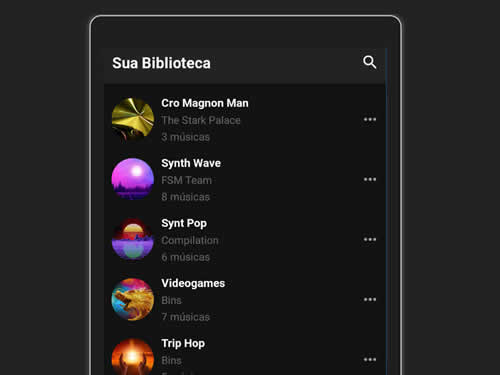

# PLAYER de músicas com React Native

Este foi o módulo 4 do curso de React Native do BootCamp da [RocketSeat](http://www.rocketseat.com.br). Este aplicativo reproduz som de arquivos no formato MP3, estas músicas estão agrupadas em listagens. As músicas são disponibilizadas a partir de uma API que acompanha este aplicativo.

O layout é parecido com o Spotify

Recursos que foram utilizados:

* Axios
* Redux
* Saga
* Reactotron
* React-Native-Sound

## Instalação

- git clone https://github.com/dbins/rocketseat-reactnative-modulo4
- npm install
- Edite o arquivo /src/services/api.js e insira o endereço de IP da API
- Edite o arquivo /src/config/ReactotronConfig.js e informe o seu IP local. Essa etapa é opcional, é apenas para quem for testar a aplicação usando o Reactotron.
- Ative a API digitando o comando json-server server.json -H 192.168.0.100 -p 3001 -w -d 500. Substitua o "192.168.0.100" pelo IP de sua máquina.
- Abra o emulador. Os testes foram feitos no Windows 10 utilizando o emulador Genymotion (Android)
- react-native run-android
